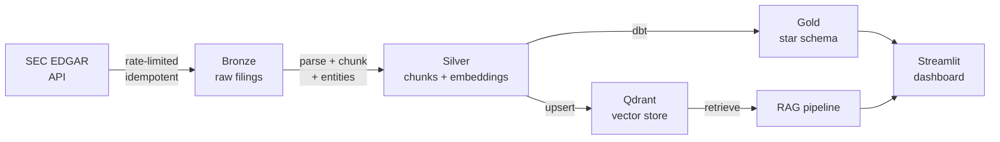

# SEC Filing RAG Pipeline

[](https://github.com/varunsingh09/sec-filing-rag-pipeline/actions/workflows/ci.yml)

A production-grade data engineering pipeline that ingests messy SEC EDGAR HTML/PDF filings, parses and chunks them, enriches with entity extraction, embeds with pluggable backends, and makes them queryable in natural language — all treated as a proper data engineering project with a warehouse, dbt semantic layer, Dagster orchestration, evaluation harness, and Streamlit dashboard.

## Live Demo & Deployment

### Streamlit Community Cloud (recommended)

The app runs in **read-only demo mode** on Streamlit Community Cloud, backed by a
pre-built dataset of ~20 filings (Apple, Microsoft, Amazon, Alphabet, NVIDIA)
committed to `demo_assets/warehouse.duckdb`.

**Deploy steps:**

1. Fork / push this repo to a public GitHub account.
2. Go to [share.streamlit.io](https://share.streamlit.io) → "New app".
3. Select this repo, branch `main`, main file `app.py`.
4. Set the **requirements file** to `requirements-app.txt`.
5. In **Advanced settings → Secrets**, add:
   ```toml
   SEC_DEMO_MODE = "true"
   ```
6. Click Deploy — the app loads `demo_assets/warehouse.duckdb` at startup with no
   ingestion or model-download step beyond sentence-transformers (~90 MB).

**To rebuild the demo dataset locally:**
```bash
pip install -e ".[sentence-transformers]"
python scripts/build_demo_data.py          # writes demo_assets/warehouse.duckdb
git add demo_assets/warehouse.duckdb
git commit -m "chore: rebuild demo dataset"
git push
```

### Self-hosted (Docker + Qdrant Cloud)

```bash
# Run Qdrant locally
docker compose up -d qdrant

# Full pipeline
SEC_EMBEDDER=sentence_transformers
SEC_QDRANT_LOCATION=http://localhost:6333
python -m scripts.run_pipeline ingest && python -m scripts.run_pipeline build
streamlit run app.py
```

### CI (GitHub Actions)

Push to `main` triggers `.github/workflows/ci.yml`:
- **black --check** + **ruff check** — code quality gates
- **pytest** (21 tests, offline, in-memory Qdrant + hashing embedder)
- **dbt build** — seeds a minimal warehouse and runs all models + 30 data tests

## Architecture



See [docs/architecture.md](docs/architecture.md) for the full Mermaid diagram and ERD.

## Quickstart (offline — no API keys, no model downloads)

```bash
# 1. Install (Python 3.11+)
pip install -e ".[st,eval,dev]"

# 2. Configure (copy and edit as needed — defaults work offline)
cp .env.example .env

# 3. Ingest 3 companies × 3 filings from EDGAR
python -m scripts.run_pipeline ingest

# 4. Parse, chunk, embed (uses offline HashingVectorizer), index in Qdrant
python -m scripts.run_pipeline build

# 5. Run dbt transformations
cd dbt && dbt build --profiles-dir . --project-dir . && cd ..

# 6. Run the deterministic retrieval eval
python -m scripts.run_pipeline eval

# 7. Run tests
pytest

# 8. Launch the Streamlit dashboard
streamlit run app.py
```

Or use `make e2e` to run steps 3-7 in one shot.

## Scaling to 500+ Filings

The `--ciks` and `--max` parameters control the scope:

```bash
# Fetch up to 20 filings each for 30 companies
python -m scripts.run_pipeline ingest \
  --ciks 0000320193,0001018724,0001652044,...  \
  --max 20

# Rebuild the index (idempotent — skips already-downloaded filings)
python -m scripts.run_pipeline build
```

The pipeline is **incremental**: a watermark file (`data/.watermark`) records the last-ingested filing date; subsequent runs only fetch newer filings.

## Switching Backends via Environment Variables

All backends are swapped in `.env` — no code changes:

| What | Variable | Options |
|------|----------|---------|
| Embedder | `SEC_EMBEDDER` | `hashing` (default, offline), `sentence_transformers`, `openai` |
| LLM | `SEC_LLM_PROVIDER` | `none` (default), `openai`, `anthropic`, `groq` |
| Vector store | `SEC_QDRANT_LOCATION` | `./qdrant_data` (default), `:memory:`, `http://localhost:6333` |
| Warehouse | `SEC_DUCKDB_PATH` | `./warehouse.duckdb` (swap dbt profile for Snowflake) |

### Example: switch to semantic embeddings + GPT-4o-mini

```bash
SEC_EMBEDDER=sentence_transformers
SEC_LLM_PROVIDER=openai
SEC_LLM_MODEL=gpt-4o-mini
OPENAI_API_KEY=sk-...
```

## Design Decisions & Tradeoffs

**Why DuckDB instead of Snowflake?**  
DuckDB runs locally with zero infrastructure and is fast enough for millions of rows. The dbt profile is the only change needed to point at Snowflake — the SQL models are identical (standard SQL).

**Why embedded Qdrant instead of Qdrant Cloud?**  
`qdrant-client` supports an embedded persistent mode (`path=./qdrant_data`) with no server process. The application code is identical to the Docker/Cloud mode — swap `SEC_QDRANT_LOCATION` and you're done.

**Why HashingVectorizer as the default embedder?**  
It has zero cold-start (no model download), works fully offline, and is deterministic. It's not semantically meaningful but makes the pipeline runnable immediately. Switch to `sentence_transformers` for real retrieval quality.

**Why is generation optional?**  
`SEC_LLM_PROVIDER=none` (the default) returns ranked chunks without generation. This keeps the pipeline runnable without any API key and makes retrieval quality independently measurable.

**Idempotency & incrementality**  
Re-running `ingest` skips already-downloaded accession numbers (checked by local directory). A watermark file persists the last-seen `filed_date` so only new filings are fetched on subsequent runs.

**Data quality**  
dbt `schema.yml` tests (`not_null`, `unique`, `relationships`) run on every `dbt build`. Custom staging WHERE clauses reject empty chunks. Row-count reconciliation (filings in → chunks out) is logged on every pipeline run.

## What Requires an API Key

| Feature | Key needed |
|---------|-----------|
| Ingest, parse, chunk, embed, index | None |
| Deterministic retrieval eval (Hit@k) | None |
| Streamlit dashboard (analytics tab) | None |
| Sentence-transformers embeddings | None (downloads ~130 MB on first run) |
| LLM-generated answers | OpenAI / Anthropic / Groq key |
| RAGAS evaluation (faithfulness) | OpenAI key |

## Project Structure

```
sec-filing-rag-pipeline/
├── src/
│   ├── config.py           # pydantic-settings, all backends swappable via .env
│   ├── models.py           # Pydantic: Filing, Chunk, Entity, QueryResult
│   ├── logging_utils.py    # structured JSON logging
│   ├── ingest/             # EDGAR downloader, HTML/PDF parser, entity extractor
│   ├── chunk/              # fixed-window chunker with overlap
│   ├── embed/              # pluggable embedder (hashing / SBERT / OpenAI)
│   ├── store/              # Qdrant wrapper + DuckDB warehouse
│   ├── rag/                # query pipeline (retrieve + optional generate)
│   └── eval/               # Hit@k sweep + RAGAS wiring
├── dagster_defs/           # Dagster software-defined assets
├── dbt/                    # dbt project: staging + marts, schema tests
├── scripts/                # CLI entry point, eval set generator
├── tests/                  # pytest unit tests
├── eval_data/              # labeled QA set
├── docs/                   # architecture + ERD diagrams
├── app.py                  # Streamlit dashboard
├── Makefile
├── pyproject.toml
├── .env.example
└── docker-compose.yml      # optional Qdrant server
```
