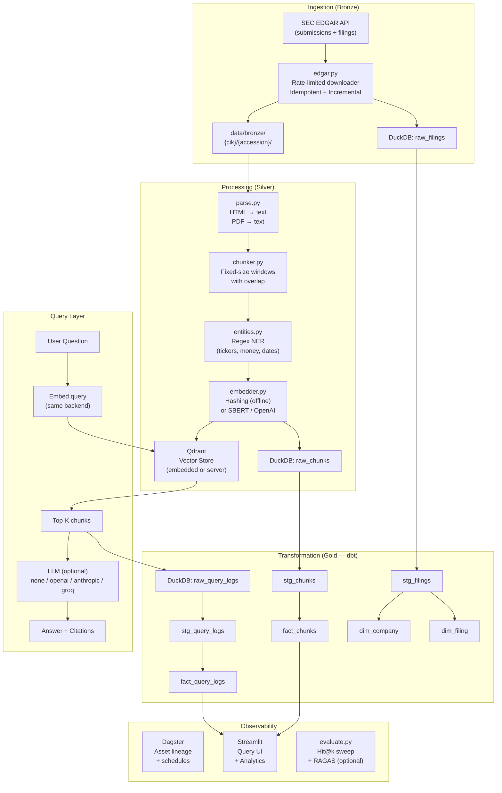
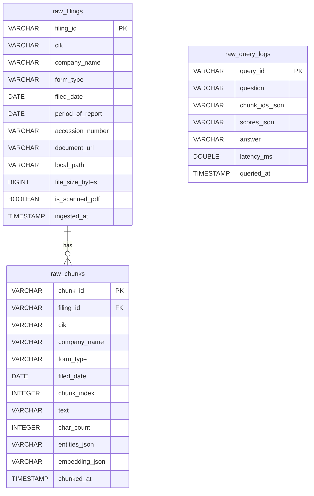

# Architecture

## System Diagram



## ERD (DuckDB tables)



## dbt Lineage

```
raw_filings ──► stg_filings ──► dim_company ──┐
                          └──► dim_filing  ──┤
                                              ├──► (dashboards)
raw_chunks  ──► stg_chunks  ──► fact_chunks ──┤
raw_query_logs ► stg_query_logs ► fact_query_logs ─┘
```

## Medallion Layers

| Layer  | Location | Contents |
|--------|----------|----------|
| Bronze | `data/bronze/{cik}/{accession}/` + `raw_filings` | Raw HTML/PDF files + filing metadata |
| Silver | `raw_chunks` → `stg_chunks` → `fact_chunks` | Parsed, chunked, entity-enriched, embedded text |
| Gold   | dbt marts (`dim_*`, `fact_*`) | Analytics-ready star schema |
